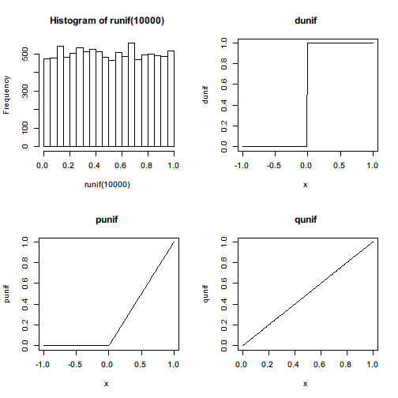
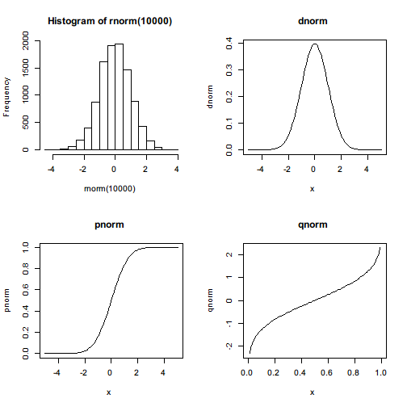

# Statistical functions

As a statistical computing environment, R provides a variety of easy-to-use statistical functions from random sampling to statistical tests. Although these built-in functions are limited, they are sufficient to handle many basic statistical problems.

## Random sampling

Random sampling is perhaps the first step of answering most statisitical questions on a population. Given a vector or a list, `sample()` function draws a sample from it with or without replacement.

For example, draw a sample of size 2 from a numeric vector without replacement.


```r
sample(c(1,2,3),size=2,replace=FALSE)
```

```
[1] 1 3
```

Another example, draw a sample of size 10 from a character vector with replacement.


```r
sample(c("a","b","z"),size=10,replace=TRUE)
```

```
 [1] "b" "a" "b" "b" "z" "b" "b" "a" "b" "z"
```

`sample()` also supports unequal weights over each observation while sampling.


```r
sample(c("Good","Medium","Poor"),size=10,replace=TRUE,prob=c(0.1,0.8,0.1))
```

```
 [1] "Medium" "Medium" "Medium" "Medium" "Medium" "Medium" "Medium"
 [8] "Medium" "Medium" "Medium"
```


## Sampling from distributions

Instead of drawing samples from a given vector or list, R also provides a set of functions to draw random samples from popular probability distributions.

### Uniform distribution

Uniform distribution is the simplest random distribution. Under uniform distribution, it is equally probable to draw any value out of a given range. To produce such a random sample, we can call


```r
runif(10)
```

```
 [1] 0.5383487 0.7489722 0.4201015 0.1714202 0.7703016 0.8819536 0.5490967
 [8] 0.2777238 0.4883060 0.9285051
```

A random sample of size 10, represented by a numeric vector, is drawn from the uniform distribution with range $$[0,1]$$. To customize the range, we can specify `min=` and `max=` arguments


```r
runif(10,min = -5,max = 5)
```

```
 [1] -1.513080  4.541577  1.952741  3.894535 -3.195928  1.293909  4.895641
 [8] -3.697111 -1.693395  3.651205
```

so that another sample uniformly distributed within $$[-5,5]$$ is drawn.

In addition to a simple random number generator, some relavent functions are also provided, including the probability density function `dunif()`, the cumulative density function `punif()`, and quantile function `qunif()`.

 

### Normal distribution

Maybe the most commonly seen random distribution in real world is the normal distribution. The way to draw normally distributed samples is almost the same with sampling from a uniform distribution. The names of the functions follow the same rules so that we don't have to remember too much.

For example, generate a sample of size 10 from standard normal distribution, that is, with zero mean and unit variance.


```r
rnorm(10)
```

```
 [1]  0.99794902  0.80106668  0.82010478 -0.09279376 -0.31225186
 [6]  1.93903077 -0.68048408 -0.04907921  0.12000937 -1.30858879
```

To draw sample from non-standard distribution, we only have to specify the two parameters `mean=` for mean and `sd=` for standard deviation.


```r
rnorm(10,mean = 10,sd = 5)
```

```
 [1] 12.9627751  4.7980781  4.0237080  0.8228835 10.4808267 10.9532740
 [7] 11.8074106 14.6699850  5.7354125  8.0848444
```

In addition to the random number generator for normal distribution, R also provides with its probability density function `dnorm()`, cumulative density function `pnorm()`, and quantile function `qnorm()`.

 

Here it is obvious that R defines 4 functions for each distribution it supports.

### Table of supported distributions

The following list contains all built-in distributions and their corresponding random number generating function.

| Distribution | Random number generator |
|:------------:|-------------------------|
| [Beta distribution](//en.wikipedia.org/wiki/Beta_distribution) | `rbeta(n = , shape1 = , shape2 = , ncp = 0)` |
| [Binomial distribution](//en.wikipedia.org/wiki/Binomial_distribution) | `rbinom(n = , size = , prob = )` |
| [Cauchy distribution](//en.wikipedia.org/wiki/Cauchy_distribution) | `rcauchy(n = , location = 0, scale = 1)` |
| [Chi-squared distribution](//en.wikipedia.org/wiki/Chi-squared_distribution) | `rchisq(n = , df = , ncp = 0)` |
| [Exponential distribution](//en.wikipedia.org/wiki/Exponential_distribution) | `rexp(n = , rate = 1)` |
| [F distribution](//en.wikipedia.org/wiki/F-distribution) | `df()` |
| [Gamma distribution](//en.wikipedia.org/wiki/Gamma_distribution) | `rgamma(n = , shape = , rate = 1, scale = 1/rate)` |
| [Geometric distribution](//en.wikipedia.org/wiki/Geometric_distribution) | `rgeom(n = , prob = )` |
| [Hypergeometric distribution](//en.wikipedia.org/wiki/Hypergeometric_distribution) | `rhyper(nn = , m = , n = , k = )` |
| [Log-normal distribution](//en.wikipedia.org/wiki/Log-normal_distribution) | `rlnorm(n = , meanlog = 0, sdlog = 1)` |
| [Multinomial distribution](//en.wikipedia.org/wiki/Multinomial_distribution) | `rmultinom(n = , size = , prob = )` |
| [Negative binomial distribution](//en.wikipedia.org/wiki/Negative_binomial_distribution) | `rnbinom(n = , size = , prob = , mu = )` |
| [Normal distribution](//en.wikipedia.org/wiki/Normal_distribution) | `rnorm(n = , mean = 0, sd = 1)` |
| [Poisson distribution](//en.wikipedia.org/wiki/Poisson_distribution) | `rpois(n = , lambda = )` |
| [Student's $$t$$ distribution](//en.wikipedia.org/wiki/Student's_t-distribution) | `rt(n = , df = , ncp = )` |
| [Uniform distribution](//en.wikipedia.org/wiki/Uniform_distribution_%28continuous%29) | `runif(n = , min = 0, max = 1)` |
| [Weibull distribution](//en.wikipedia.org/wiki/Weibull_distribution) | `rweibull(n = , shape = , scale = 1)` |

The density functions, probability functions, and quantile functions for the above distributions can be easily figured out by following the naming conventions that `rxxx` stands for random numeric generator, `dxxx` for density function, `pxxx` for probability function, and `qxxx` for quantile function.

## Summary statistics

Random distributions are tools to describe the features of random variables. Summary statistics are sometimes of our central interest and informative enough for making descisions.

A few functions calculate specific summary statistics for a given sample. The following table summarizes these functions.

| Statistic | Function |
|:---------:|----------|
| Mean | `mean(x = , ... = )`|
| Standard deviation | `sd(x = , na.rm = FALSE)` |
| Variance | `var(x = , y = NULL, na.rm = FALSE, use = )` |
| Corvariance | `cov(x = , y = NULL, use = "everything", method = c("pearson", ,     "kendall", "spearman"))` |
| Correlation | `cor(x = , y = NULL, use = "everything", method = c("pearson", ,     "kendall", "spearman"))` |
| Median | `median(x = , na.rm = FALSE)` |
| Quantile | `quantile(x = , ... = )` |
| Maximum | `max()` |
| Minimum | `min()` |
| Range | `range()` |

The following examples show how these functions can be used. First we generate a random numeric vector of length 30 from standard normal distribution.


```r
x <- rnorm(30)
x
```

```
 [1] -0.90035066 -0.45992252  2.46985327  0.07654286  1.58312121
 [6] -0.06608715 -1.65127263  1.55845790  0.88590800  1.70313588
[11]  1.93925519 -0.63345737 -0.63624338 -1.47024681  0.52223872
[16]  0.81135400 -0.93122568 -0.96534549 -0.80879575 -2.70799853
[21] -0.55794839  1.94983117 -0.22325966  1.60173266 -1.25742475
[26] -2.05238757  0.13731471  0.79804935 -0.59605865 -1.45335455
```

To see the summary statistics for such a sample, we can call the functions in the table. We can calculate its mean, standard deviation, and median.


```r
c(mean=mean(x),sd=sd(x),median=median(x))
```

```
       mean          sd      median 
-0.04448615  1.33276476 -0.34159109 
```

We can compute its quantiles. `quantile()` by default calculates the 0%, 25%, 50%, 75%, and 100% quantiles.


```r
quantile(x)
```

```
        0%        25%        50%        75%       100% 
-2.7079985 -0.9235069 -0.3415911  0.8672695  2.4698533 
```

To customize the quantiles, specify `probs=` argument.


```r
quantile(x,probs = c(0.5,0.8))
```

```
       50%        80% 
-0.3415911  1.5633906 
```

We can call `min()` and `max()` to see its smallest and largest values, respectively. `range()` returns both of them together in a numeric vector.


```r
c(min=min(x),max=max(x))
```

```
      min       max 
-2.707999  2.469853 
```

```r
range(x)
```

```
[1] -2.707999  2.469853
```

In addition, `pmin()` and `pmax()` are used to work element-wisely for all vectors.


```r
pmax(c(1,2,3),c(2,3,1))
```

```
[1] 2 3 3
```

```r
pmin(c(1,2,3),c(2,3,1),c(3,2,1))
```

```
[1] 1 2 1
```

Also a function named `summary()` can be used to directly show all important location summary statistics.


```r
summary(x)
```

```
    Min.  1st Qu.   Median     Mean  3rd Qu.     Max. 
-2.70800 -0.92350 -0.34160 -0.04449  0.86730  2.47000 
```

In fact, this function is a generic function that works for many types of objects and has different behaviors. It is very useful in data analysis. We will cover it in detail later.

## Statistical tests

A large part of statistics is about drawing samples from a population, and making inference of population features by inspecting these samples. To answer questions like *Is the average score of this group higher than that of the other group?* statistical tests often play important roles.

Statistical tests allow us to answer these kinds of questions in statistical sense when we only have partial information. They also tell us at the same time to what extent we should feel confident about the conclusion.

A number of functions are designed to conduct one specific or a family of statistical tests.

For example, suppose we have two samples of exam scores for Class A and Class B. If the assumption is considered reasonable that scores of the students in both classes follow normal distribution respectively, we can use t-test to see whether the two classes truly have a difference in average score.


```r
classA <- c(9,9,8,10,6,7,9,6,9,10,10,8,7,8)
classB <- c(10,7,7,9,8,10,8,9,9,8,7,10,9,9,8,7)
t.test(classA,classB)
```

```

	Welch Two Sample t-test

data:  classA and classB
t = -0.33019, df = 24.708, p-value = 0.744
alternative hypothesis: true difference in means is not equal to 0
95 percent confidence interval:
 -1.0991073  0.7955359
sample estimates:
mean of x mean of y 
 8.285714  8.437500 
```

The t-test suggests that we cannot reject the null hypothesis that the true difference between the two groups equal to 0 with quite a big confidence. It does not say that the true difference equals zero but that there's no much evidence to support a significant non-zero difference.

Suppose we get more observations of scores for each class and we redo the t-test,


```r
classA <- c(9,9,8,10,6,7,9,6,9,10,10,8,7,8,10,10,9,9,10,8,10)
classB <- c(10,7,7,9,8,10,8,9,9,8,7,10,9,9,8,7,6,7,6,6,9,6,5,7,6)
t.test(classA,classB)
```

```

	Welch Two Sample t-test

data:  classA and classB
t = 2.3123, df = 43.746, p-value = 0.02553
alternative hypothesis: true difference in means is not equal to 0
95 percent confidence interval:
 0.121445 1.771888
sample estimates:
mean of x mean of y 
 8.666667  7.720000 
```

we find that the $$t$$-statistic gets much larger and $$p$$-value much smaller, which is a strong sign of significant difference between the average scores of the two classes. This time, we have much more confidence to reject the null hypothesis and claim that the two classes probably have different average scores.

This is merely an example of location difference test carried out in a very rough way. R provides much wider range of statisitcal tests than this. We will cover them in later chapters.
